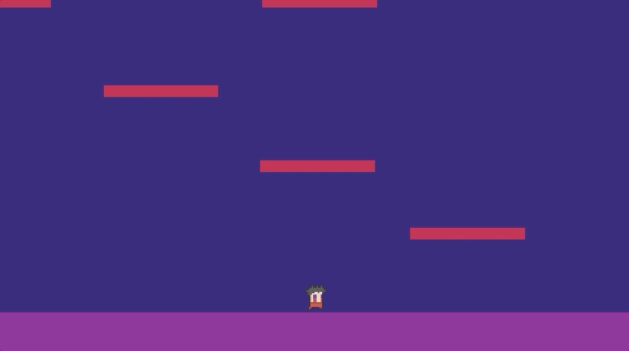

# Unity Animation Examples

A sample Unity (2020.2.2f1) project that shows

- Basic sprite animation and controller
- Timeline animation using keyframes
- Animating and controlling a 2D character

## Sprite_Anim_Fred

Basic sprite animation and character controller

- Uses [pixeldudesmaker generator](https://0x72.itch.io/pixeldudesmaker) by [0x72](https://0x72.itch.io/)
